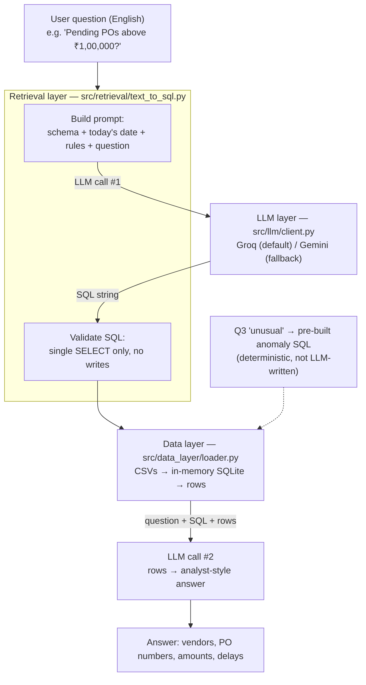

# Architecture — SAP Copilot (Week 1 decision record)

## Pipeline

**Max 2 LLM calls per question.** No agent loop, no unbounded tool-calling.

| Layer | File | Owns | Knows nothing about |
|---|---|---|---|
| Data | `src/data_layer/loader.py` | CSV → SQLite | LLMs |
| Retrieval | `src/retrieval/text_to_sql.py` | schema prompt, SQL validation, execution | which LLM provider |
| LLM | `src/llm/client.py` | `ask(prompt, system)` | SAP, SQL |
| Formatting | 2nd `ask()` call | turning rows into a readable answer | — |

## Decision 1 — Text-to-SQL over function-calling

| | Text-to-SQL ✅ | Function-calling |
|---|---|---|
| How | LLM writes SQL against the schema | LLM picks from N pre-written query functions |
| Covers new questions | Yes, anything the schema can answer | Only ones we pre-built |
| Safety | Needs a SELECT-only validator | Safe by construction |
| Code per new question | None | One function each |

Chosen because every seed question is a filter / aggregate / join over exact
fields, and one code path covers all five. The risk (LLM writes a bad or
destructive query) is handled by a SELECT-only validator plus a read-only
connection.

**Exception: Q3 "unusual transactions"** uses a pre-built query. Anomaly rules
must be deterministic and explainable, not whatever the LLM guesses on a given day.

## Decision 2 — The Q3 anomaly rule

A PO is flagged if **either**:
- `amount > mean(category) + 2 × stddev(category)` (statistical outlier), **or**
- another PO has the same `vendor_id + amount + po_date` (likely double entry).

On current mock data this flags exactly the seeded cases: 3 outliers
(PO00148, PO00020, PO00081) and 2 duplicates (PO00221, PO00222). Verified in
`tests/test_seed_questions.py`.

## Decision 3 — Stack

| Piece | Choice | Why |
|---|---|---|
| Language | Python 3.11+ (tested on 3.14) | team default |
| Data | pandas → SQLite (in-memory) | zero setup, real SQL, small data |
| LLM | Groq `llama-3.3-70b-versatile` default, Gemini flash fallback, via `LLM_PROVIDER` | free tier; locked Day 1. **Not Claude/Anthropic**, despite the original plan text |
| Framework | **None** (no LangChain) | 2 plain API calls per question; a framework only adds layers to debug |
| Tests | pytest | — |

`requirements.txt` verified: installs cleanly into a fresh venv, all imports
succeed, tests pass. Known item: `google-generativeai` is deprecated in favour
of Google's `google-genai` SDK. It still works; migrate in Week 2 if Gemini is used.

## Prompt rules the LLM must be given (Week 2 input)

- Today's date, so "this month" / "this week" resolve correctly (data ends 2026-09-20).
- Blank values are `NULL`, so use `IS NULL` / `COALESCE`, never `= ''`.
- Dates are ISO `YYYY-MM-DD` text, so use `julianday()` for date arithmetic.
- Currency is ₹ (INR); ₹1,00,000 = `100000`.
- Exact status vocab: POs `Pending/Approved/Rejected/Closed`; payments `Paid/Scheduled`.
- "Category" means `purchase_orders.category`, **not** `vendors.vendor_category`.
  They disagree on 178 of 220 POs, so picking the wrong one gives a wrong answer
  with no error.
- `delivery_date` is the *scheduled* delivery date (like SAP's EKET-EINDT), not
  confirmation that the goods arrived.
- Output one `SELECT` statement only.

## Known simplifications (vs real SAP)

- PO header (EKKO) + items (EKPO) are flattened into one `purchase_orders` table.
- `vendor_id` is copied into `payments`, which spares the LLM a join.
- One payment per PO (no partial payments or multiple invoices).

## SAP sanity check

> **Draft. The SAP/ABAP lead needs to confirm or correct each point.** The join
> results below come from SQL run against the mock data. The SAP comparisons
> are the starting point for her review.

### 1. Do the joins hold up once queries go through SQL? ✅ Yes

Checked on the loaded SQLite DB:

| Check | Result |
|---|---|
| Orphan `vendor_id` / `po_id` in any table | 0 |
| Payments per PO | max 1, so joins can't duplicate rows |
| `payments ⋈ purchase_orders ⋈ vendors` row count | 163 = 163 payments, no fan-out |
| `payments.vendor_id` ≠ its PO's `vendor_id` | 0 |
| Payments on `Pending` / `Rejected` POs | 0 |
| `due_date` ≠ `delivery_date + payment_terms_days` | 0 |
| Payment date before PO date or delivery date | 0 |
| `Paid` with no `payment_date` / `Scheduled` with one | 0 / 0 |

The three tables join cleanly on either path (`payments → vendors` directly, or
through `purchase_orders`), so the LLM can't pick a join that gives wrong totals.

**On the denormalized `payments.vendor_id`:** this matches SAP. The vendor
(LIFNR) is on the PO header (EKKO) and also on the accounting and clearing
line items (BSEG / BSAK). It isn't only a shortcut.

### 2. Flattening PO header + items (EKKO/EKPO) into one table: ✅ OK for Week 2

In SAP, category (material group, EKPO-MATKL), quantity and price sit on the
item. One PO can span several material groups. All 5 seed questions work at PO
level, so one row per PO is fine. **Revisit if** we add questions like "top
materials" or "quantity ordered", which need an items table.

### 3. Are the status values realistic? ⚠️ Fine as labels, not literal SAP fields

SAP has no single "PO status" field. Our values map to:

| Mock status | SAP equivalent |
|---|---|
| `Pending` / `Approved` / `Rejected` | Release strategy status (EKKO-FRGKE / FRGZU) |
| `Closed` | Delivery completed + final invoice flags (EKPO-ELIKZ / EREKZ) |
| `Paid` / `Scheduled` | Cleared vs open vendor item (BSAK vs BSIK) |

That's good enough for a copilot that speaks business language. Worth keeping
this mapping for when we connect real SAP.

**Found: 36 `Pending` POs have a `delivery_date` in the past.** In SAP, goods
can't be received against an unreleased PO. The data still works as long as
`delivery_date` is read as the *scheduled* date, not an actual delivery (now a
prompt rule above). Otherwise it's something to fix in the Day 5 data pass.

### 4. `due_date = delivery_date + payment_terms_days`: ⚠️ close enough

In SAP, the due date is baseline date (ZFBDT) + payment terms (ZTERM). The
baseline is usually the **invoice/document date**, not the delivery date. The
terms live on the vendor master (LFB1) but can be overridden per PO
(EKKO-ZTERM). With no invoice table in the mock, using the delivery date as the
baseline is a reasonable stand-in, since invoices usually follow delivery by a few days.
Delay figures are therefore approximate, which is fine for the demo.

### Other observations

- **`purchase_orders.category` vs `vendors.vendor_category`** disagree on 178 of
  220 POs (81%). In SAP a vendor doesn't have a single category, so a mismatch is
  normal. But at 81%, `vendor_category` isn't useful, and it's a trap for the
  LLM (now a prompt rule above). Option: drop it in the Day 5 data pass.
- **Real SAP pays invoices, not POs** (PO → goods receipt → invoice
  RBKP/RSEG → payment). One payment per PO is fine for Week 2. An invoices table
  becomes necessary once partial payments or 3-way-match anomalies come in.
- **No currency column.** SAP stores it per PO (EKKO-WAERS). We assume INR
  everywhere, recorded in the prompt rules.
- **2 `Paid` payments have a NULL amount** (PMT00012, PMT00113). Real SAP won't
  clear a payment with no amount, so these are clearly data-quality test cases,
  as intended.

### For the Day 5 data pass
- [ ] Add 2–3 more September delays (currently 1, which makes the "this month" demo thin)
- [ ] Decide: keep or drop `vendors.vendor_category`
- [ ] Decide: clear `delivery_date` on `Pending` POs, or keep the "scheduled date" reading
